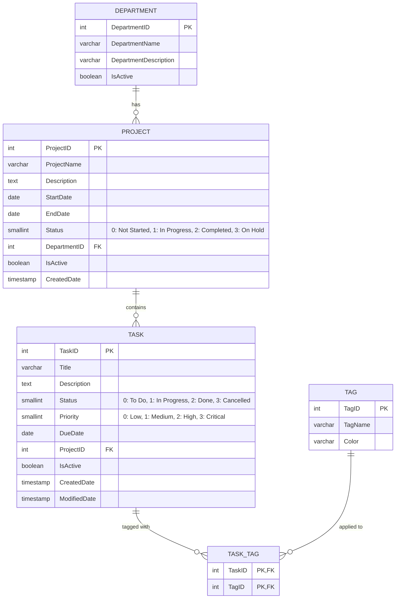

# PRN232 — Assignment 01: Task & Team Management Application

**Author:** Duong The Truyen
**Student ID:** QE170128  
**Class Code:** PRN232_SAMPLE  
**Course:** PRN232 (Practical Exam 1)

**Backend GitHub:** https://github.com/truyendt/QE170128_PRN232_SAMPLE_Ass1_BE  
**Frontend GitHub:** https://github.com/truyendt/QE170128_PRN232_SAMPLE_Ass1_FE  
**Render API:** https://truyendt-tasktrack-api.onrender.com  
**Swagger:** https://truyendt-tasktrack-api.onrender.com/swagger  
**Vercel:** https://my-assignment.vercel.app

---

## 📌 Architecture & Technology Stack

- **Backend:** ASP.NET Core Web API (.NET 8)
  - `TaskTrack.API`: Web Controllers, Swagger OpenAPI, CORS policy, Dependency Injection.
  - `TaskTrack.Repo`: Entity Framework Core (Database-First mapped), Generic Repository & Unit of Work pattern.
  - `TaskTrack.Service`: Service interfaces & business logic, DTOs, and field validation.
- **Frontend:** Next.js 15 (App Router, TypeScript, Tailwind CSS, Lucide Icons)
  - Responsive public browsing (`/`, `/departments`, `/departments/[id]`, `/projects/[id]`, `/tasks/[id]`, `/search`).
  - Public CRUD management consoles (`/departments/manage`, `/projects/manage`, `/tasks/manage`, `/tags/manage`).
- **Database:** PostgreSQL (seeded via `TaskManagementDB_Postgres (1).sql`).
- **Deployment:**
  - Backend Web API: Render.com Web Service
  - Database: Render.com PostgreSQL
  - Frontend: Vercel

---

## 🗄️ Database Entity-Relationship Diagram (ERD)



---

## 🚀 Getting Started Locally

### 1. Database Setup
Ensure PostgreSQL is running locally on port 5432, then execute the seed script:
```bash
psql -U postgres -d postgres -f "TaskManagementDB_Postgres (1).sql"
```

### 2. Run the Backend API (.NET 8)
```bash
cd QE170128_SE19B.NET_Ass1_BE
dotnet restore
dotnet run --project TaskTrack.API
```
- Copy `TaskTrack.API/appsettings.Example.json` when creating a local settings file, and set `DATABASE_URL` in the shell before running the API. A local `.env` file is not loaded automatically by ASP.NET Core.
- Swagger UI will be available at: `http://localhost:5066` or `http://localhost:5066/swagger`
- Health check endpoint: `http://localhost:5066/health`

### 3. Run the Frontend (Next.js)
```bash
cd QE170128_SE19B.NET_Ass1_FE
npm ci
npm run dev
```
- Copy `.env.example` to `.env.local`; set `NEXT_PUBLIC_API_URL` to the backend base URL (without `/api`).
- Open [http://localhost:3000](http://localhost:3000) in your browser.

---

## 🌐 Deployment Instructions

### Backend (Render.com)
1. Push this repository to GitHub.
2. In Render Dashboard, click **New > PostgreSQL** and create a database named `taskmanagementdb`.
3. In the Render PostgreSQL instance, connect via psql or Query Tool and run `TaskManagementDB_Postgres (1).sql`.
4. Create a **New > Web Service** connected to your repository:
  - **Root Directory:** `QE170128_SE19B.NET_Ass1_BE`
   - **Environment:** `Docker` (or .NET)
   - **Environment Variables:**
    - `DATABASE_URL`: Render PostgreSQL connection URL.
     - `ASPNETCORE_ENVIRONMENT`: `Production`
    - `ALLOWED_ORIGINS`: `https://my-assignment.vercel.app`

### Frontend (Vercel)
1. In Vercel, click **Add New > Project** and import the GitHub repository.
2. Set **Root Directory** to `QE170128_SE19B.NET_Ass1_FE`.
3. Under **Environment Variables**, set:
  - `NEXT_PUBLIC_API_URL`: `https://truyendt-tasktrack-api.onrender.com`
4. Click **Deploy**.

---

## ✨ Implemented Bonus Features

1. **Status Filter Tabs on Project Task View:** Quick filter tasks on `/projects/[id]` by *All*, *To Do*, *In Progress*, or *Done*.
2. **GitHub Actions CI/CD Pipeline:** Automated `.github/workflows/ci.yml` verifying backend compilation (.NET 8) and frontend production builds.
3. **Mermaid ERD Diagram:** Integrated into the repository README.
4. **Soft-Delete Implementation:** Task deactivation preserves relational integrity by toggling `IsActive = false`.
5. **Business Deletion Guards:** Server returns HTTP 400 when attempting to delete Departments with linked projects, Projects with linked tasks, or Tags assigned to tasks.
